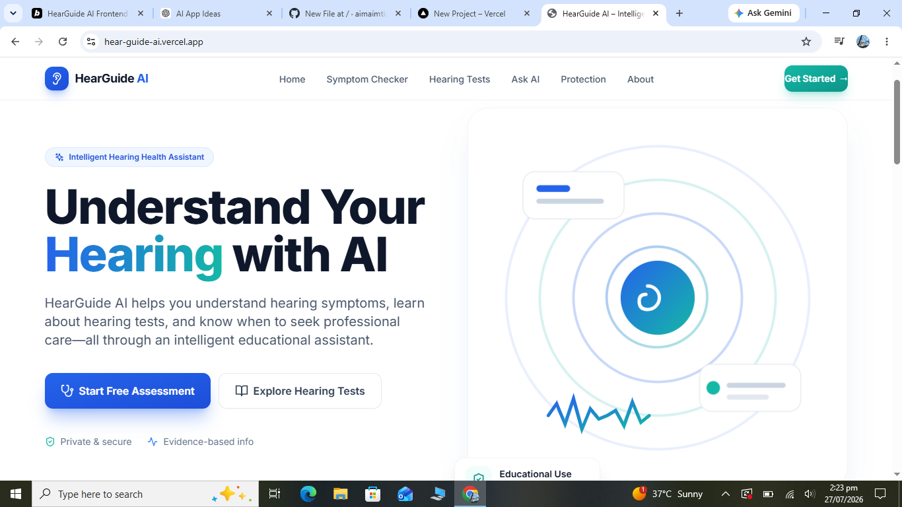
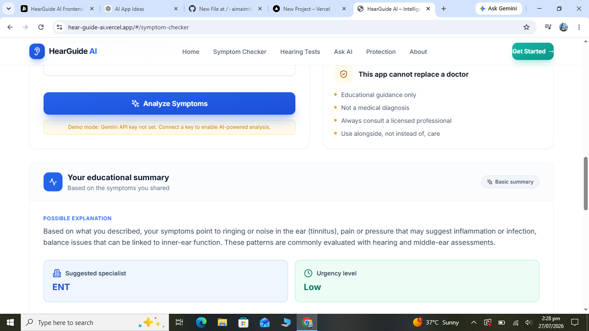
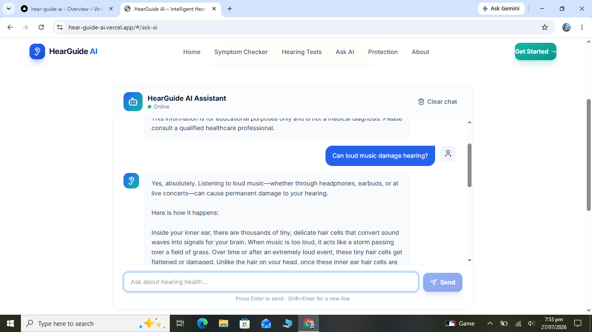
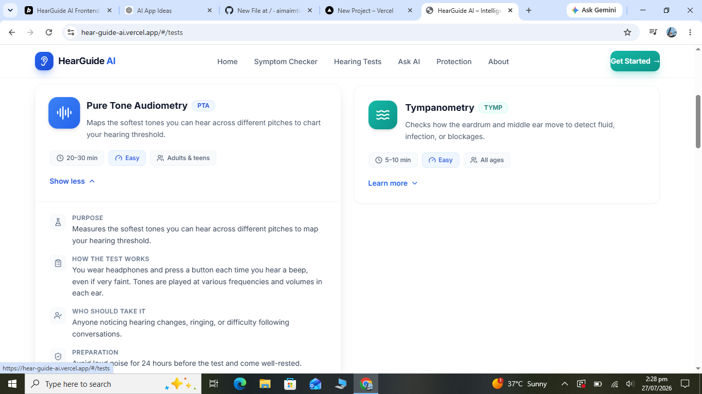
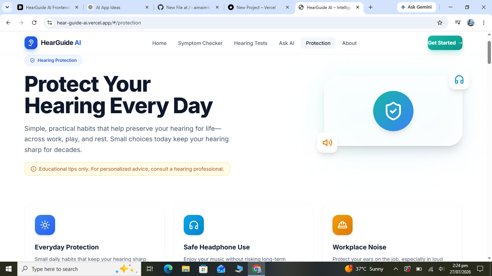
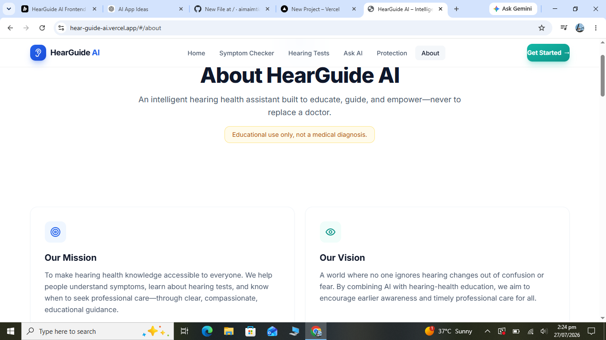

# 🦻 HearGuide AI

An AI-powered hearing health web application that provides educational guidance on hearing symptoms, hearing tests, hearing protection, and common ear conditions using **Google Gemini AI**.

---

# 🌐 Live Demo

🔗 **Live Application:**  
https://hear-guide-ai.vercel.app/

---

# 📖 Overview

HearGuide AI is a responsive web application designed to educate users about hearing health through Artificial Intelligence.

Many people experience hearing problems but are unsure whether their symptoms require medical attention or which healthcare professional they should consult. Medical information is often difficult to understand, especially for people without a healthcare background.

HearGuide AI simplifies hearing health education by combining modern web technologies with Google Gemini AI to provide easy-to-understand educational guidance.

**This application is intended for educational purposes only and does not provide medical diagnoses.**

---

# ❗ Problem Statement

Hearing problems affect millions of people worldwide, yet many individuals:

- Ignore early symptoms.
- Do not know when to consult a healthcare professional.
- Have little knowledge of hearing tests.
- Are unaware of safe hearing practices.
- Need trustworthy educational information in simple language.

HearGuide AI helps bridge this gap by offering AI-powered educational support in an easy-to-use web application.

---

# 🎯 Target Users

This application is designed for:

- General public
- Students
- Adults experiencing hearing symptoms
- Parents concerned about children's hearing
- Older adults
- Individuals wanting to protect their hearing
- Anyone seeking educational hearing health information

---

# ✨ Features

## 🏠 Home Page

- Modern responsive landing page
- Professional healthcare-inspired design
- Navigation to all modules
- Feature overview
- Call-to-action buttons

---

## 🤖 AI Symptom Checker

Users can enter:

- Age
- Hearing symptoms
- Duration
- Affected ear
- Severity level
- Additional notes

Google Gemini AI provides educational feedback including:

- Possible Explanation
- Recommended Specialist
- Urgency Level
- Suggested Hearing Tests
- Hearing Protection Advice
- Medical Disclaimer

Emergency symptoms such as sudden hearing loss, ear bleeding, severe dizziness, head injury, and severe ear pain are identified and users are advised to seek immediate medical attention.

---

## 💬 Ask HearGuide AI

Interactive AI chatbot capable of answering questions about:

- Hearing loss
- Tinnitus
- Hearing protection
- Hearing tests
- Ear infections
- Audiologists
- ENT specialists
- Noise exposure
- Hearing care

Features include:

- Conversation history
- Suggested questions
- Loading indicators
- Error handling
- Friendly educational responses

---

## 🩺 Hearing Tests

Provides educational information about:

- Pure Tone Audiometry (PTA)
- Tympanometry
- Speech Audiometry
- Otoacoustic Emissions (OAE)
- Auditory Brainstem Response (ABR)

Each section explains:

- Purpose
- Procedure
- Duration
- Preparation
- Recommended users

---

## 🛡 Hearing Protection

Educational guidance covering:

- Safe headphone use
- Noise exposure
- Workplace hearing protection
- Concert safety
- Swimming and ear care
- Children's hearing protection
- Daily healthy hearing habits

Includes:

- Safe listening checklist
- WHO-inspired listening recommendations
- Hearing protection tips
- Frequently Asked Questions

---

## ℹ️ About Page

Provides:

- Project mission
- Vision
- Objectives
- Technologies used
- Educational disclaimer

---

# 🧠 AI Integration

HearGuide AI uses **Google Gemini AI** to power two intelligent features.

## 1. AI Symptom Checker

The symptom checker analyzes user-provided hearing symptoms and generates structured educational guidance.

It returns:

- Possible Explanation
- Recommended Specialist
- Urgency Level
- Suggested Hearing Tests
- Hearing Protection Advice
- Medical Disclaimer

---

## 2. AI Chatbot

The chatbot allows users to ask hearing-related questions using natural language.

Example questions:

- Can stress cause tinnitus?
- What causes hearing loss?
- What is an audiologist?
- How can I protect my hearing?
- What happens during a hearing test?

---

# 🤖 AI System Prompt

The AI follows these rules:

- Explain hearing symptoms using clear and simple language.
- Provide educational information only.
- Never diagnose diseases.
- Never prescribe medications.
- Recommend an Audiologist or ENT specialist when appropriate.
- Immediately advise emergency medical care if users mention:
  - Sudden hearing loss
  - Ear bleeding
  - Severe dizziness
  - Head injury
  - Severe ear pain
- Always end every response with:

> "This information is for educational purposes only and is not a medical diagnosis. Please consult a qualified healthcare professional."

---

# 🛠 Technologies Used

### Frontend

- React
- TypeScript
- Vite
- Tailwind CSS

### AI

- Google Gemini API
- Google AI Studio

### Development Tools

- Bolt.new
- GitHub
- npm

---

# 📂 Project Structure

```
project/
│
├── screenshots/
├── src/
├── public/
├── package.json
├── vite.config.ts
├── README.md
└── .env
```

---

# 🚀 Getting Started

## Clone the repository

```bash
git clone https://github.com/YOUR_GITHUB_USERNAME/HearGuide-AI.git
```

## Navigate into the project

```bash
cd HearGuide-AI
```

## Install dependencies

```bash
npm install
```

## Configure Environment Variables

Create a `.env` file in the project root.

```env
VITE_GEMINI_API_KEY=YOUR_GEMINI_API_KEY
```

## Start the development server

```bash
npm run dev
```

## Build the project

```bash
npm run build
```

---

# 📸 Application Screenshots

## 🏠 Home Page

Modern landing page introducing HearGuide AI and its main features.



---

## 🤖 AI Symptom Checker

Users enter hearing symptoms and receive structured educational guidance generated by Google Gemini AI.




---

## 💬 Ask HearGuide AI

Interactive AI chatbot that answers hearing-health questions using Google Gemini AI.



---

## 🩺 Hearing Tests

Educational information about common hearing tests and their purpose.



---

## 🛡 Hearing Protection

Helpful tips and best practices for protecting hearing in everyday life.



---

## ℹ️ About HearGuide AI

Project mission, objectives, technologies, and educational disclaimer.



---

# 🔒 Medical Disclaimer

HearGuide AI is intended **for educational purposes only**.

It does **not** provide medical diagnoses or prescribe medications.

Users experiencing severe or emergency hearing symptoms should seek immediate medical evaluation from a qualified healthcare professional.

---

# 🔮 Future Improvements

Potential future enhancements include:

- User authentication
- Hearing assessment history
- Nearby clinic locator
- Appointment scheduling
- Voice-based AI assistant
- Multi-language support
- Accessibility improvements
- Personalized hearing health dashboard
- Dark mode
- Downloadable AI reports

---

# 👩‍💻 Developer

**Aima Imtiaz**

Final Year Project

---

# 🙏 Acknowledgements

This project was built using:

- Google Gemini AI
- Bolt.new
- React
- Vite
- Tailwind CSS
- GitHub
- The open-source community

---

# 📄 License

This project is developed for educational and academic purposes.
